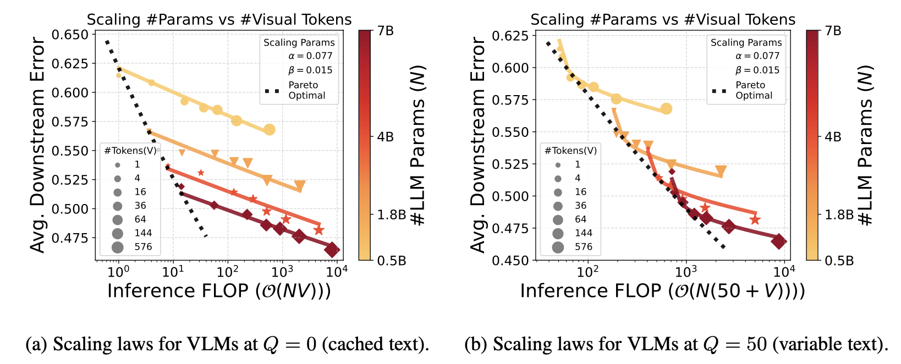
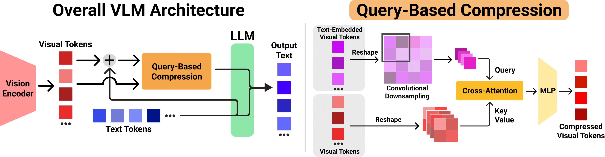

# Inference Optimal VLMs Need Only One Visual Token but Larger Models



> **Inference Optimal VLMs Need Only One Visual Token but Larger Models**\
> Kevin Y. Li*, Sachin Goyal*, João D. Semedo, J. Zico Kolter \
> Paper: https://arxiv.org/abs/2411.03312v1

Our repo contains two components: our **QueCC** token compression algorithm and our scaling law fitting code. The QueCC algorithm compresses tokens via a cross-attention mechanism that utilizes query-based convolutional downsampling. 

## Scaling Law Findings and code
Our scaling laws find that for various visual understanding and reasoning tasks, under fixed VLM inference compute, it is more optimal to utilize the largest LLM component by reducing the number of visual tokens. In fact, performance on these types of tasks vary $5\times$ faster when adjusting the number of LLM parameters than the number of visual tokens. However, for OCR-like tasks, the opposite is true: the number of visual tokens is more important the size of the LLM.

The relevant code that we used to fit our scaling laws can be found in the [scaling_law_code/](scaling_law_code/) folder and the instructions can be found in its [README](scaling_law_code/README.md).

## Query Based Token Compression

Our repo is built upon the original [LLaVA repo](https://github.com/haotian-liu/LLaVA). Setup, training hyperparameters, etc., are the same as detailed in the linked repo.

The QueCC token compression module is spread across a couple files. These components can be copied and transferred over to one's own repository:

[train](llava/train/train.py) has been adjusted to include [more model arguments](llava/train/train.py#L55) to allow for token compression flexibility, e.g., change downsampling rate, and to [pass in the pointers to the LLM and tokenizer](llava/train/train.py#L1148) when processing images for the query-based compression. 

[llava_arch](llava/model/llava_arch.py) has been adjusted to include the [additional model arguments](llava/model/llava_arch.py#L50) and [preprocessing of user queries for compression](llava/model/llava_arch.py#L214).

[clip_encoder](llava/model/multimodal_encoder/clip_encoder.py) has been modified to pass in the [required features for compression](llava/model/multimodal_encoder/clip_encoder.py#L84).

The [projector builder](llava/model/multimodal_projector/builder.py) has been [changed to include QueCC](llava/model/multimodal_projector/builder.py#L57) and QueCC's implementation can be found in a [new file](llava/model/multimodal_projector/quecc.py).

Example pretraining and finetuning scripts can be found [here](scripts/v1_5/pretrain.sh) and [here](scripts/v1_5/finetune.sh), respectively.

## Citation
If you find our scaling laws or compression algorithm valuable or insightful, please cite our paper:
```
@misc{li2024inferenceoptimalvlmsneed,
      title={Inference Optimal VLMs Need Only One Visual Token but Larger Models}, 
      author={Kevin Y. Li and Sachin Goyal and Joao D. Semedo and J. Zico Kolter},
      year={2024},
      eprint={2411.03312},
      archivePrefix={arXiv},
      primaryClass={cs.CV},
      url={https://arxiv.org/abs/2411.03312}, 
}
```
